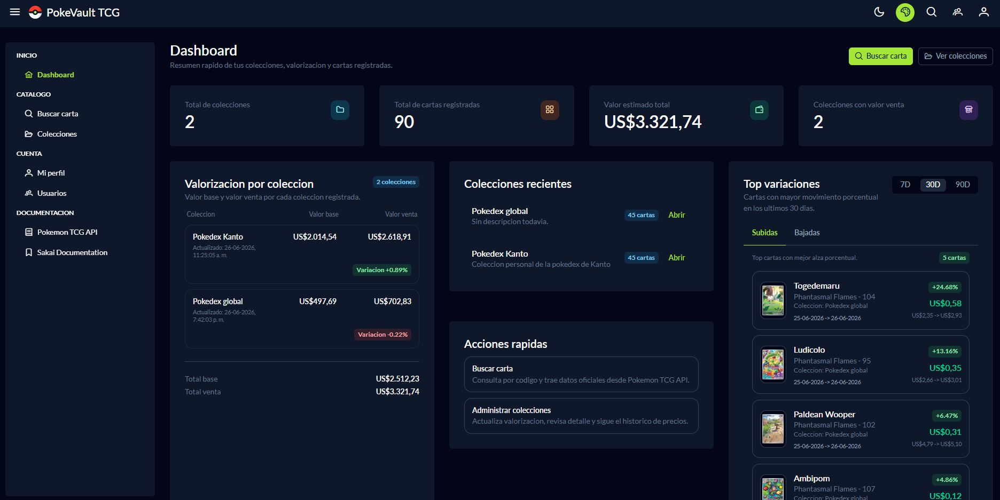
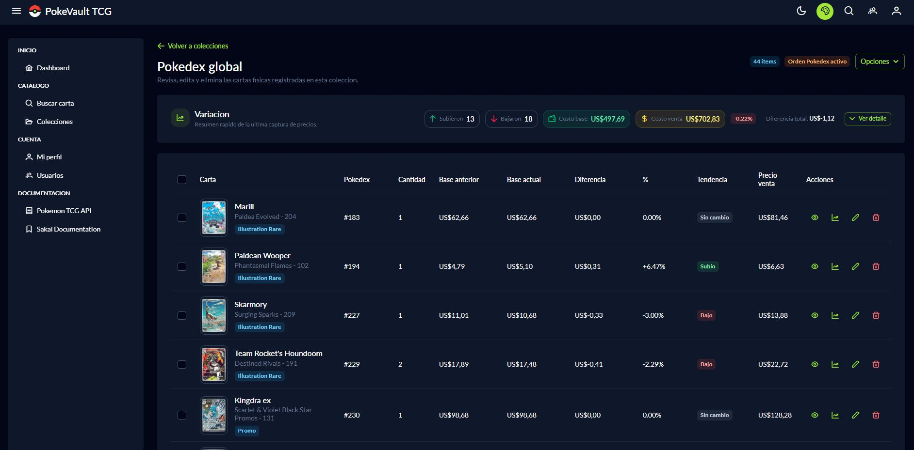
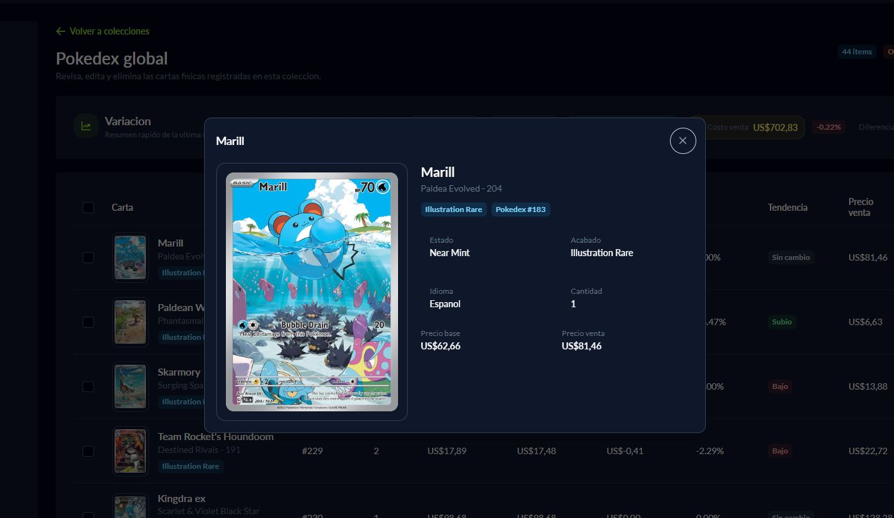

# PokeVault TCG

<p align="center">
  
</p>

PokeVault TCG is a personal Pokemon TCG card manager focused on real inventory. It lets you search cards, add them to collections, track condition, finish and language, value collections, export data, and manage users on your own local stack.

## Current status

The project already has a functional MVP built with a Vue 3 + Sakai/PrimeVue frontend and a FastAPI + PostgreSQL backend.

You can also review the functional history in [CHANGELOG.md](./CHANGELOG.md).

## Screenshots

### Dashboard



### Collection detail and valuation



### Card preview



## Existing features

### Authentication and account

- JWT login.
- Forced password change on first access.
- Password change from the top menu.
- Own profile editing.
- User administration for administrators only.
- User creation and editing with active status, admin role and forced password change controls.
- Administrators can access global system administration and are not limited by collection permissions.
- The login screen does not preload default credentials.

### Visual preferences

- Sakai theme with light and dark mode.
- Preset, primary color and surface selection.
- Per-user persistence in browser `localStorage`.
- Custom topbar logo for PokeVault TCG.

### Card search

- General search by name or code.
- Standard code search in `160/165` format.
- Code masking and normalization, for example `001/165 -> 1/165`.
- Promo search by code, for example `SVP/088`.
- Promo search by name.
- Support for subsets and special codes such as `TG01/TG30`.
- Search fallback to TCGdex when Pokemon TCG API does not return results.
- Source badge to distinguish external results when applicable.

### Inventory and collections

- Create, edit and delete collections.
- Table view for collections.
- Confirmation before deleting a collection.
- Collection settings in a modal.
- Per-collection toggle to sort Pokemon cards by Pokedex number and keep non-Pokemon cards at the end.
- Only user-defined collections are created; no default seed collections are generated.
- Collection detail with card table, multi-select and valuation panel.
- Edit items inside a collection.
- Move one or multiple cards between collections.
- Local inventory search regardless of which collection contains the card.
- Ownership support per collection.
- Collection collaborators with `viewer` and `editor` roles.
- Ownership transfer to another authorized user.
- The owner can manage collaborators and transfer the collection.
- A `viewer` collaborator can see the collection but cannot modify it.
- An `editor` collaborator can edit items and operate on the collection but cannot manage ownership.
- Public and private visibility remains available as a functional collection property.

### Adding cards to inventory

- Add cards from search results.
- Avoids logical duplicates through merge behavior by card and collection when appropriate.
- Manual creation for cards not available in external APIs.
- Option to upload a manual image when creating or importing a card.
- Persistence of add-dialog preferences.
- Last used collection.
- Language.
- Condition.
- Finish.
- Special pattern support for variants such as Poke Ball Pattern and Master Ball Pattern.
- Suggested finish prefill using API metadata and prices when possible.

### Card images

- External image URL is stored in the database.
- A local copy of the image is also stored in persistent storage.
- Support for `small` and `large` image sizes.
- Local endpoint to serve images from PokeVault TCG.
- Enlarged card preview from collection detail and inventory search.
- This partially protects your inventory from image changes or removals in external APIs.

### Valuation and pricing

- Collection valuation in the dashboard.
- Dashboard only shows collections that contain cards.
- Collections are sorted by descending price in valuation views.
- Refresh prices per collection.
- Price snapshot history per item.
- Variation between the latest valuation and the previous one.
- If an API returns no price or returns `0`, a valid previous manual value is not automatically overwritten.
- Currency support based on available source data, including USD and EUR cases.

### Export

- Export collection to PDF.
- Export collection to Excel.
- PDF export supports 2 or 3 columns.
- PDF export uses images served by the system itself.
- Options to include TCG price and final sale price.
- The PDF includes data such as name, rarity, condition, edition, finish, language and quantity.
- Excel is exported as a table ready to sort or filter later.

### External integrations

- Main integration with Pokemon TCG API.
- Backup integration with TCGdex for unresolved searches from the main API.
- Automatic `X-Api-Key` header forwarding from backend when `POKEMON_TCG_API_KEY` is configured.

## Stack

### Backend

- FastAPI
- SQLAlchemy Async
- Alembic
- PostgreSQL
- Docker

### Frontend

- Vue 3
- PrimeVue
- Sakai Vue
- Vite
- Tailwind utility classes

## Environment variables

Copy `.env.example` to `.env` and adjust the values for your environment.

| Variable | Description |
| --- | --- |
| `POSTGRES_USER` | PostgreSQL user |
| `POSTGRES_PASSWORD` | PostgreSQL password |
| `POSTGRES_DB` | Database name |
| `POSTGRES_PORT` | Local PostgreSQL container port |
| `DATABASE_URL` | Async connection string used by the backend |
| `CORS_ORIGINS` | Allowed frontend origins |
| `POKEMON_TCG_API_URL` | Pokemon TCG API base URL |
| `POKEMON_TCG_API_KEY` | API key sent as `X-Api-Key` |
| `MEDIA_ROOT` | Local storage path for images |
| `SEED_DEFAULT_ADMIN` | If `true`, attempts to bootstrap an initial admin |
| `TERMS_VERSION` | Current terms of use version |
| `AUTH_SECRET_KEY` | JWT secret |
| `AUTH_TOKEN_TTL_HOURS` | Token duration |
| `VITE_API_BASE_URL` | Frontend API base URL |

## How to run the project

### With Docker Compose

1. Copy `.env.example` to `.env`.
2. Fill in `POKEMON_TCG_API_KEY` when available.
3. Run from the repository root:

```powershell
docker compose up -d --build
```

4. If you need to apply migrations manually:

```powershell
docker compose exec backend alembic upgrade head
```

### Local services

- Frontend: `http://localhost:8080`
- Backend: `http://localhost:8000`
- Swagger/OpenAPI: `http://localhost:8000/docs`

## Initial access

- The login screen does not prefill `Admin / Admin`.
- If `SEED_DEFAULT_ADMIN=true`, the backend will try to create the initial administrator defined by the bootstrap seed.
- On first login, any user marked with `must_change_password=true` will be redirected to forced password change.

If you do not want automatic admin bootstrap in a new environment, disable the corresponding seed before deployment.

## Useful commands

```powershell
docker compose up -d --build
docker compose down
docker compose logs -f backend
docker compose logs -f frontend
docker compose exec backend alembic upgrade head
```

## Main endpoints

### Health and authentication

- `GET /api/health`
- `POST /api/auth/login`
- `GET /api/auth/me`
- `POST /api/auth/change-password`
- `GET /api/me/terms-status`
- `POST /api/me/accept-terms`

### Cards

- `GET /api/cards/search`
- `GET /api/cards/{id}`
- `GET /api/cards/{id}/image?size=small|large`

### Dashboard and collections

- `GET /api/dashboard/collections-valuation`
- `POST /api/collections`
- `GET /api/collections`
- `GET /api/collections/{id}`
- `PATCH /api/collections/{id}`
- `DELETE /api/collections/{id}`
- `POST /api/collections/{id}/refresh-prices`
- `GET /api/collections/{id}/price-variation`
- `GET /api/collections/{id}/collaborators`
- `POST /api/collections/{id}/collaborators`
- `DELETE /api/collections/{id}/collaborators/{user_id}`
- `POST /api/collections/{id}/transfer-ownership`

### Collection items

- `POST /api/collections/{id}/items`
- `POST /api/collections/{id}/items/import`
- `POST /api/collections/{id}/items/manual`
- `GET /api/collections/{id}/items`
- `GET /api/collection-items/search?query=...`
- `PATCH /api/collection-items/{id}`
- `DELETE /api/collection-items/{id}`
- `POST /api/collection-items/move`
- `GET /api/collection-items/{id}/price-history`

### Users

- `GET /api/users`
- `GET /api/users/options`
- `POST /api/users`
- `PATCH /api/users/me`
- `PATCH /api/users/{id}`

## Permission model

- `admin`: can manage users and has global access to collections and inventory.
- `owner`: collection owner. Can edit it, manage collaborators and transfer ownership.
- `editor`: collaborator with edit permission over the collection and its items.
- `viewer`: collaborator with view-only permission.

For collection endpoints, the backend distinguishes `view`, `edit` and `manage` permissions to resolve access based on the user role.

## Persistence

Docker Compose uses two main volumes:

- `postgres_data`: PostgreSQL data
- `pokevault_media`: local card images

This allows inventory and images to persist even when you rebuild containers.

## Project structure

```txt
pokevault/
|-- backend/
|-- frontend/
|-- docs/
|-- docker-compose.yml
|-- .env.example
|-- README.md
|-- CHANGELOG.md
```

## Documentation roadmap

- `README.md`: overall vision, setup, environment variables, usage and architecture.
- `CHANGELOG.md`: functional changes after the MVP.

## Support the project

PokeVault TCG is a free, open-source and unofficial project built for personal Pokemon TCG collection management.

If this project is useful to you and you would like to support its development, you can optionally send a voluntary contribution.

Your support helps with maintenance, improvements, documentation, bug fixes and future features.

[Buy me a coffee](https://paypal.me/pokevaulttcg)

Contributions are completely optional. PokeVault TCG will remain free and open source.

## Disclaimer

This project is independent and is not affiliated with Nintendo, Creatures, GAME FREAK, The Pokemon Company, Pokemon TCG API or TCGdex.
